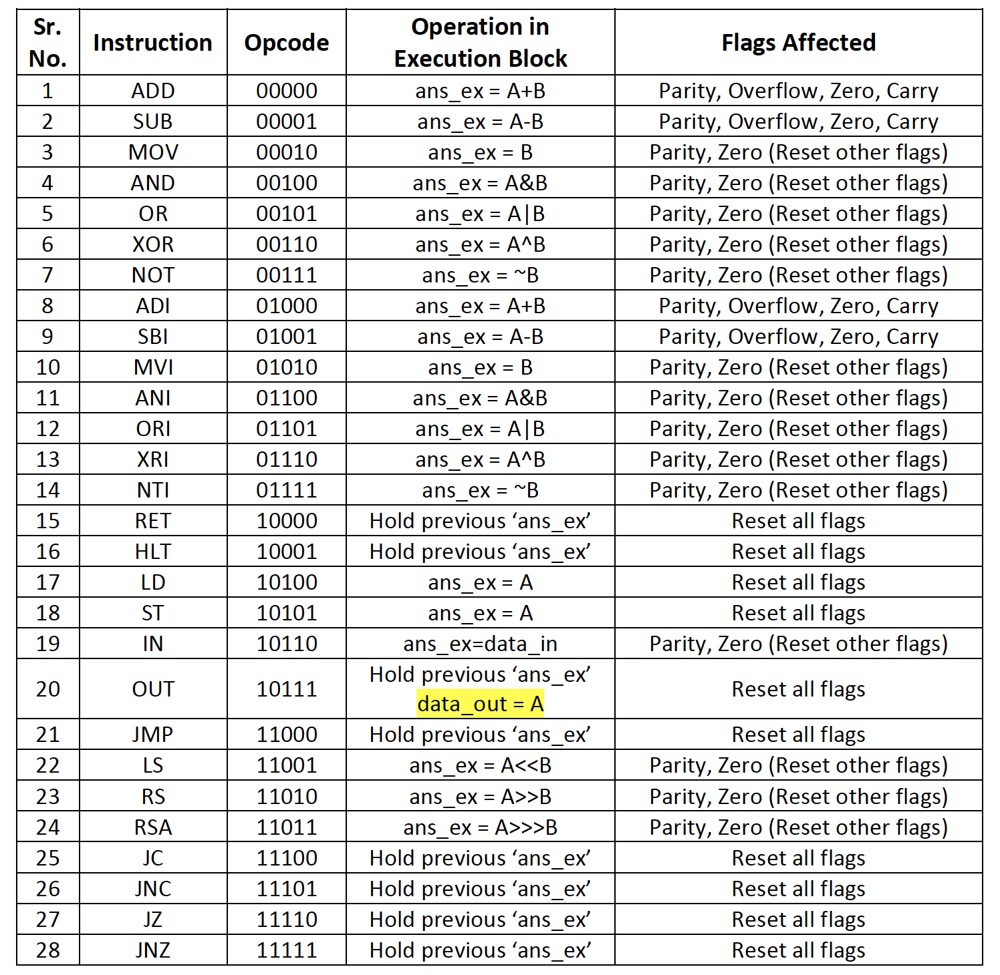
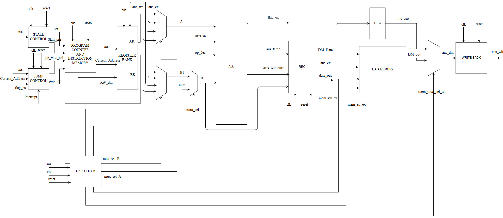

# Microprocessor-Without-Interlocked-Pipeline-Stages-MIPS

<!-- PROJECT SHIELDS -->
[![Contributors][contributors-shield]][contributors-url]

[![MIT License][license-shield]][license-url]

<!-- TABLE OF CONTENTS -->
## Table of Contents

* [About the Project](#about-the-project)
  * [Built With](#built-with)
  * [Features](#features)
  * [Specifications](#specifications)
  * [Opcodes and Operations](#opcode-and-operations)
  * [Instruction Formats](#instruction-formats)
  * [Block Diagram](#block-diagram)
* [Individual Modules](#individual-modules)
  * [Execution Block](#execution-block)
  * [Program Counter and Instruction Memory Block](#program-counter-and-instruction-memory-block)
  * [Register Bank](#register-bank)
  * [Data Memory Block](#data-memory-block)
  * [Stall Control Block](#stall-control-block)
  * [Write Back Block](#write-back-block)
  * [Jump Control Block](#jump-control-block)
  * [Dependency Check Block](#dependency-check-block)
* [Simulation Results](#simulation-results)
* [Usage](#usage)
* [Contributing](#contributing)
* [License](#license)
* [Contact](#contact)
* [Acknowledgements](#acknowledgements)

<!-- ABOUT THE PROJECT -->
## About The Project

Photo by <a href="https://unsplash.com/@lazycreekimages?utm_source=unsplash&amp;utm_medium=referral&amp;utm_content=creditCopyText">Michael Dziedzic</a> on <a href="https://unsplash.com/s/photos/microprocessor?utm_source=unsplash&amp;utm_medium=referral&amp;utm_content=creditCopyText">Unsplash</a>

RISC based 8-bits five stage pipelined processor, operating at 585 MHz clock frequency with 19 I/O
pins and 28 instructions having 5 Addressing formats. Tested on Xilinx Artix-7 FPGA.

### Built With
* [Xilinx ISE](https://www.xilinx.com/products/design-tools/ise-design-suite.html)
* [Nexys A7: FPGA](https://store.digilentinc.com/nexys-a7-fpga-trainer-board-recommended-for-ece-curriculum/)

### Features

* Interrupt allowed.
* Pipeline structure.
* Unconditional or Conditional jumps, both are allowed. 

### Specifications

* Architecture: 8 Bits
* Total stages: 5
* Instruction set: 24 Bit
* Input / Output pins: 21
* Frequency: 585 MHz (100 MHz on Artix-07)
* CPI: 1.25
* Data memory: 8 Width, 256 Depth
* Program Memory: 24 Width, 256 Depth
* Opcodes: 28
* Total interrupts: 1
* Registers: 32
* Address: 8 Bits
* Total flags: 4
  * flag[0]= carry
  * flag[1]= zero
  * flag[2]= overflow
  * flag[3]= parity
* Register bank size: 32*8 bits
* Instruction formats: 7
* Total types of jumps: 5
  * Conditional: 4
  * Unconditional: 1

### Opcodes and Operations

### Instruction Formats

### Block Diagram

<!-- Individual Modules -->
## Individual Modules

### Execution Block
### Program Counter and Instruction Memory Block
### Register Bank
### Data Memory Block
### Stall Control Block
### Write Back Block
### Jump Control Block
### Dependency Check Block

<!-- Simulation Results -->
## Simulation Results

<!-- USAGE EXAMPLES -->
## Usage

<!-- CONTRIBUTING -->
## Contributing  

Contributions are what make the open source community such an amazing place to learn, inspire, and create. Any contributions you make are **greatly appreciated**.

1. Fork the Project
2. Create your Feature Branch (`git checkout -b feature/amazing-feature`)
3. Commit your Changes (`git commit -m 'feat: some amazing feature'`)
4. Push to the Branch (`git push origin feature/amazing-feature`)
5. Open a Pull Request

<!-- LICENSE -->
## License

Distributed under the MIT License. See `LICENSE` for more information.

<!-- CONTACT -->
## Contact
 

Maharsh Suryawala - [Portfolio](https://maharshsuryawala.github.io/maharshsuryawala/)

Project Link: [https://github.com/MaharshSuryawala/Microprocessor-Without-Interlocked-Pipeline-Stages-MIPS](https://github.com/MaharshSuryawala/Microprocessor-Without-Interlocked-Pipeline-Stages-MIPS)

<!-- ACKNOWLEDGEMENTS -->
## Acknowledgements
* [Img Shields](https://shields.io)
* [Iconify](https://iconify.design/)
* [MIT License](https://opensource.org/licenses/MIT)
* [Unsplash](https://unsplash.com/)
* [Badgen](https://badgen.net/)
* [For The Badge](https://forthebadge.com/)

<!-- MARKDOWN LINKS -->
<!-- https://www.markdownguide.org/basic-syntax/#reference-style-links -->
[contributors-shield]: https://img.shields.io/github/contributors/MaharshSuryawala/Microprocessor-Without-Interlocked-Pipeline-Stages-MIPS?style=flat-square 
[contributors-url]: https://github.com/MaharshSuryawala/Microprocessor-Without-Interlocked-Pipeline-Stages-MIPS/graphs/contributors
[license-shield]: https://img.shields.io/github/license/MaharshSuryawala/Microprocessor-Without-Interlocked-Pipeline-Stages-MIPS?style=flat-square?style=flat-square
[license-url]: https://github.com/MaharshSuryawala/Microprocessor-Without-Interlocked-Pipeline-Stages-MIPS/blob/master/LICENSE.txt
