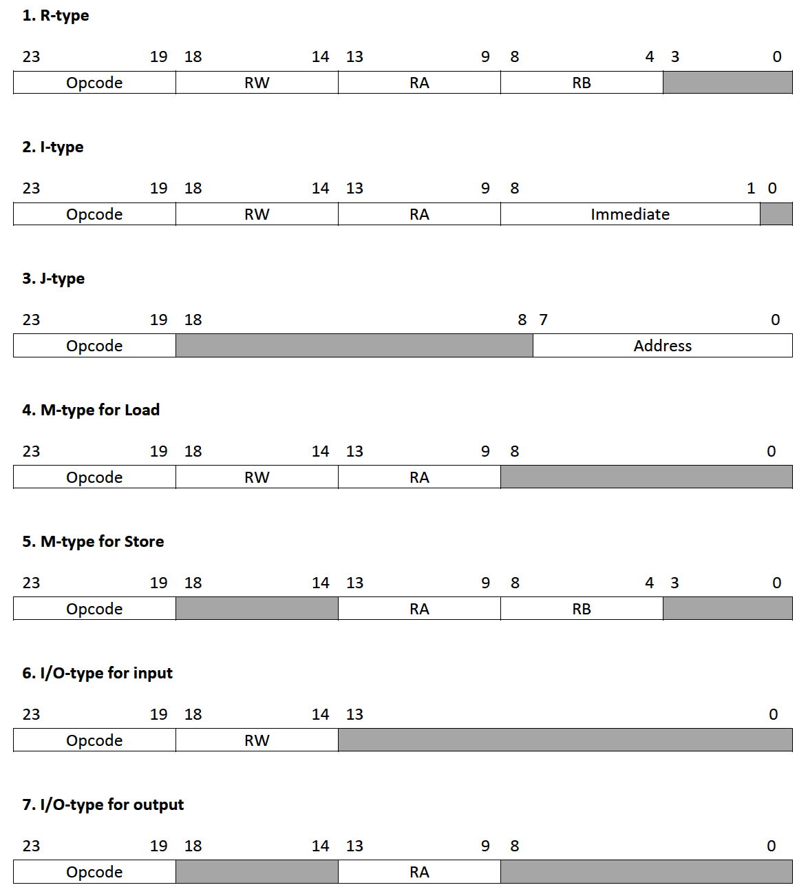

# Microprocessor-Without-Interlocked-Pipeline-Stages-MIPS

<!-- PROJECT SHIELDS -->
[![Contributors][contributors-shield]][contributors-url]

[![MIT License][license-shield]][license-url]

<!-- TABLE OF CONTENTS -->
## Table of Contents

* [About the Project](#about-the-project)
  * [Built With](#built-with)
  * [Features](#features)
  * [Specifications](#specifications)
  * [Opcodes and Operations](#opcode-and-operations)
  * [Instruction Formats](#instruction-formats)
  * [Block Diagram](#block-diagram)
* [Individual Modules](#individual-modules)
  * [Arithmetic-Logic Unit](#arithmetic-logic-unit)
  * [Execution Block](#execution-block)
  * [Program Counter and Instruction Memory Block](#program-counter-and-instruction-memory-block)
  * [Register Bank](#register-bank)
  * [Data Memory Block](#data-memory-block)
  * [Stall Control Block](#stall-control-block)
  * [Write Back Block](#write-back-block)
  * [Jump Control Block](#jump-control-block)
  * [Dependency Check Block](#dependency-check-block)
* [Simulation Results](#simulation-results)
* [Usage](#usage)
* [Contributing](#contributing)
* [License](#license)
* [Contact](#contact)
* [Acknowledgements](#acknowledgements)

<!-- ABOUT THE PROJECT -->
## About The Project

Photo by <a href="https://unsplash.com/@lazycreekimages?utm_source=unsplash&amp;utm_medium=referral&amp;utm_content=creditCopyText">Michael Dziedzic</a> on <a href="https://unsplash.com/s/photos/microprocessor?utm_source=unsplash&amp;utm_medium=referral&amp;utm_content=creditCopyText">Unsplash</a>

RISC based 8-bits five stage pipelined processor, operating at 585 MHz clock frequency with 19 I/O
pins and 28 instructions having 5 Addressing formats. Tested on Xilinx Artix-7 FPGA.

### Built With
* [Xilinx ISE](https://www.xilinx.com/products/design-tools/ise-design-suite.html)
* [Nexys A7: FPGA](https://store.digilentinc.com/nexys-a7-fpga-trainer-board-recommended-for-ece-curriculum/)

### Features

* Interrupt allowed.
* Pipeline structure.
* Unconditional or Conditional jumps, both are allowed. 

### Specifications

* Architecture: 8 Bits
* Total stages: 5
* Instruction set: 24 Bit
* Input / Output pins: 21
* Frequency: 585 MHz (100 MHz on Artix-07)
* CPI: 1.25
* Data memory: 8 Width, 256 Depth
* Program Memory: 24 Width, 256 Depth
* Opcodes: 28
* Total interrupts: 1
* Registers: 32
* Address: 8 Bits
* Total flags: 4
  * flag[0]= carry
  * flag[1]= zero
  * flag[2]= overflow
  * flag[3]= parity
* Register bank size: 32*8 bits
* Instruction formats: 7
* Total types of jumps: 5
  * Conditional: 4
  * Unconditional: 1

### Opcodes and Operations

### Instruction Formats

### Block Diagram

<!-- Individual Modules -->
## Individual Modules

### Arithmetic-Logic Unit

* An arithmetic logic unit (ALU) is a digital electronic circuit that performs arithmetic and bitwise logical operations on integer binary numbers. 
* An ALU is a fundamental building block of many types of computing circuits, including the central processing unit (CPU) of computers and graphics processing units (GPUs). 
* A single CPU or GPU may contain multiple ALUs.
* The inputs to an ALU are the data to be operated on, called operands; and an opcode (operation code) indicating the operation to be performed; the ALU's output is the result of the performed operation. 
* In many designs, the ALU also exchanges additional information with a status register (flag), which relates to the result of the current or previous operations.

### Execution Block

* The executon block fetches instructions from the queue, decodes the instructions and executes the arithmetic-logical operations using the ALU block. 

* Note:
  * Arithmetic operations are on 2's complemented numbers.
  * 'reset' is negative level triggered and clock synchronous.

* Execution Block Simulation Results:

### Program Counter and Instruction Memory Block

* Generates instructions for decode, execution, and data memory blocks. 
* Takes care of different controls. 

* There are 3 different 2 x 1 multiplexer having selection line namely ‘Stall’, ‘pc_mux_sel’ and ‘Stall_pm’ respectively. 
* ‘Stall’ generated from ‘stall control’ block (i.e. one of the module of processor) which is used to select assign either Hold_Address or Next_Address as CAJ. 
* ‘pc_mux_sel’ decides whether current address will pass to program memory or address provided by ‘jump control’ block. 
* A mux with ‘Stall_pm’ selection bit decides whether to pass actual instruction (PM_out) or pass previous instruction (ins_prv) to ‘ins_pm’. 
* Another two multiplexers with ‘reset’ selection bit are used to reset ‘Current_Address’ and ‘ins’ values.
* Processor needs to generate new instruction at every positive edge of clock and ‘program counter’ will provide address of the new instruction. 
* Program counter is combination of ‘increment’ (+) and ‘register’ block. 
* ‘Increment’ block increments address and register will pass that value to ‘Next_Address’ on every positive edge of the clock and when there is reset it will clear the output of ‘register’.
* Another important block is program memory which has been designed using Xilinx IP core generator.

* Program Counter and Instruction Memory Block Simulation Results:

* Note:
  * The memory data for each address can be written in the COE file. The COE file can be generated using Xilinx ISE. The ROM_data.txt is present in the repository.
  * [For more details click here.](https://www.xilinx.com/support/documentation/sw_manuals/xilinx10/isehelp/cgn_p_memed_single_block.htm)
  
### Register Bank

* This block generates operands (A and B) for Execution block based on the instruction generated from Instruction Memory block. 
* Instruction bits 13 to 9 are used as first operand (A) address and 8 to 4 are used as second operand (B) address.

* If applied instruction is register type then both the operands are fetched from register bank, else one operand (A) is fetched from register bank and other operand (B) is taken as an immediate number (imm). 
* This selection is controled by 2x1 Mux.
* Data forwarding operations are performed by both 4x1 Mux based on the values applied to it’s selection line (mux_sel_A and mux_sel_B).
* Answer from Data Memory block (ans_dm) is written in register bank as per the address indicated by RW_dm.

* Register Bank Simulation Results:

### Data Memory Block

* Data Memory is designed using IP core. 
* It’s a 256x8 RAM with R/W and enable signal. 

* Data read or write in Data Memory is possible only if ‘mem_en_ex’ signal is 
  * If ‘mem_rw_ex’ is 0 data read operation will perform else data write. 
* Data written in the Data Memory should be provided to ‘DM_data’; and ‘ans_ex’ is used as an address.
* 2x1 Mux is used to select between execution block answer (Ex_out) or Data Memory’s output (DM_out). 
* When ‘mem_mux_sel_dm’ is 1, it will select ‘DM_out’ as an ‘ans_dm’ else it will select ‘Ex_out’ as an ‘ans_dm’.

* Data Memory Block Simulation Results:

### Stall Control Block

* Some instructions like ‘Load’ and ‘Conditional Jump’ will create control hazard in pipeline processor. 
* To overcome this problem, we need to stall pipeline for one or two clock cycles. 

* Stall Control block decides when to stall a pipeline. 
* Also, this block will stall pipeline forever when ‘HLT’ instruction will execute.

Stall Control Block Simulation Results:

### Write Back Block

* Write Back block is used to delay ‘ans_dm’ for one clock cycle. 
* This block helps to resolve read after write hazard in the IDOF (Instruction Decode and Operand Fetch) stage.

### Jump Control Block

* Jump control block generates jump location address (jmp_loc) and mux control signal (pc_mux_sel) for program memory block, based on jump conditions and value of interrupt. 
* For conditional jumps (JC, JNC, JZ and JNZ), if condition is true then ‘pc_mux_sel’ value will be ‘1’, else we check for unconditional jump (JMP), interrupt and return (RET) instructions, if any of these instruction/signal is true then also ‘pc_mux_sel’ value will be ‘1’, for other cases ‘pc_mux_sel’ value will be ‘0’.

* When interrupt signal value is ‘1’, we stores ‘current_address’ and ‘flag_ex’ in the system and program will jump to interrupt subroutine location (8’hF0). 
* When interrupt subroutine is over then we provide RET instruction to continue our main program, for that we need to reproduc ‘current_address’ and ‘flag_ex’ which was previously stored in system.

* Jump Control Block Simulation Results:

### Dependency Check Block

* Dependency check block handles data hazard in pipeline processor. 
* It can check dependency of current instruction with previous three instructions and enables data forwarding in pipeline by generating ‘mux_sel_A’ and ‘mux_sel_B’ signals. 
* This block is also generates memory control and immediate control signals. All outputs of this block are generated at the positive edge of clock.

* Dependency Check Block Simulation Results:

<!-- Simulation Results -->
## Simulation Results

* Addition 

* Multiplication

<!-- USAGE EXAMPLES -->
## Usage

* Upload the mainmodule.bit file on [Nexys A7: FPGA.](https://store.digilentinc.com/nexys-a7-fpga-trainer-board-recommended-for-ece-curriculum/)

* Download the repository. Open the project in Xilinx ISE and simulate the mainmodule_tb.v file.  
 

<!-- CONTRIBUTING -->
## Contributing  

Any contributions you make are **greatly appreciated**.

1. Fork the Project
2. Create your Feature Branch (`git checkout -b feature/amazing-feature`)
3. Commit your Changes (`git commit -m 'feat: some amazing feature'`)
4. Push to the Branch (`git push origin feature/amazing-feature`)
5. Open a Pull Request

<!-- LICENSE -->
## License

Distributed under the MIT License. See `LICENSE` for more information.

<!-- CONTACT -->
## Contact
 

Maharsh Suryawala - [Portfolio](https://maharshsuryawala.github.io/maharshsuryawala/)

Project Link: [https://github.com/MaharshSuryawala/Microprocessor-Without-Interlocked-Pipeline-Stages-MIPS](https://github.com/MaharshSuryawala/Microprocessor-Without-Interlocked-Pipeline-Stages-MIPS)

<!-- ACKNOWLEDGEMENTS -->
## Acknowledgements
* [Img Shields](https://shields.io)
* [Iconify](https://iconify.design/)
* [MIT License](https://opensource.org/licenses/MIT)
* [Unsplash](https://unsplash.com/)
* [Badgen](https://badgen.net/)
* [For The Badge](https://forthebadge.com/)

<!-- MARKDOWN LINKS -->
<!-- https://www.markdownguide.org/basic-syntax/#reference-style-links -->
[contributors-shield]: https://img.shields.io/github/contributors/MaharshSuryawala/Microprocessor-Without-Interlocked-Pipeline-Stages-MIPS?style=flat-square 
[contributors-url]: https://github.com/MaharshSuryawala/Microprocessor-Without-Interlocked-Pipeline-Stages-MIPS/graphs/contributors
[license-shield]: https://img.shields.io/github/license/MaharshSuryawala/Microprocessor-Without-Interlocked-Pipeline-Stages-MIPS?style=flat-square?style=flat-square
[license-url]: https://github.com/MaharshSuryawala/Microprocessor-Without-Interlocked-Pipeline-Stages-MIPS/blob/master/LICENSE.txt
